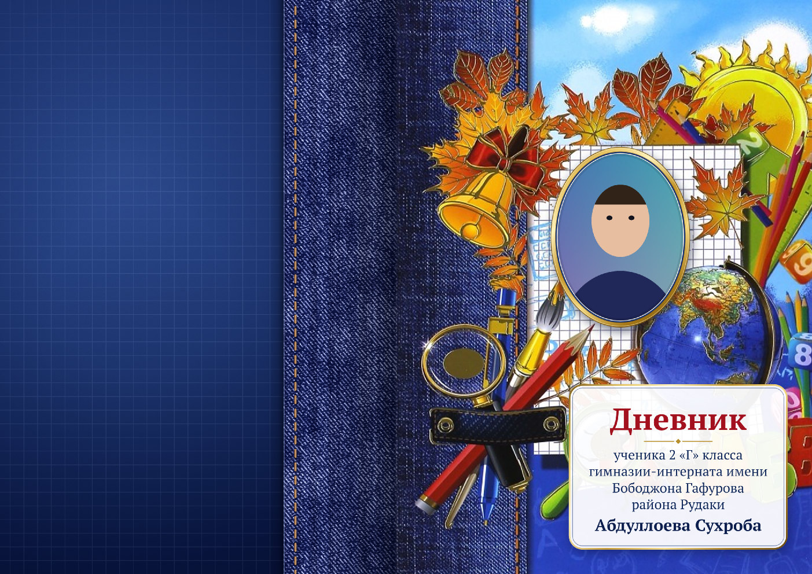

# Дневник‑Креатор

Одностраничное приложение для вёрстки и пакетной предпечатной подготовки разворотов школьных дневников. Всё умещается в один файл **`index.html`**: интерфейс на Tailwind CSS, отрисовка на Canvas 2D, чистый JavaScript. JSZip, FileSaver и jsPDF подключаются через CDN. Исходная обложка `cover.jpg` встроена в файл в виде base64.



## Запуск

1. Откройте `index.html` в Chrome, Edge, Яндекс.Браузере или Firefox. Можно двойным щелчком прямо с диска, сервер не нужен.
2. Нужен интернет: с CDN грузятся Tailwind, шрифты и библиотеки экспорта. Если основной CDN недоступен, JSZip/jsPDF/FileSaver догружаются с зеркал.

## Рабочий процесс

1. **«Вставить из Excel»**: выделите ячейки в Excel или Google Таблицах, скопируйте (`Ctrl+C`) и вставьте в окно (`Ctrl+V`). Можно просто нажать `Ctrl+V` на странице: таблица из буфера сама откроется в окне импорта. Файлы CSV/TXT/XLSX тоже читаются.
2. **«Папка с фото…»** или **«Фото…»**: выберите все фотографии класса сразу. Можно перетащить файлы или целую папку прямо на страницу.
3. Фото сопоставляются с учениками автоматически. Проверьте список слева: у каждой строки есть аватар, пол и статус готовности.
4. Выберите ученика и поправьте портрет. На развороте фото **тянется мышью**, **колесо** меняет масштаб, **двойной щелчок** сбрасывает кадрирование. Для точной посадки справа есть ползунки масштаба, смещения X/Y и поворота. Между учениками переключают `PgUp`/`PgDn`.
5. **«Пакетный экспорт»**: ZIP с PNG или JPEG либо единый многостраничный PDF.

## Формат таблицы

```text
Номер | ФИО_Именительный | ФИО_Родительный | Пол (М/Ж) | Имя_Файла
1       Абдуллоев Сухроб   Абдуллоева Сухроба   М           1.jpg
2       Азимова Мадина     Азимовой Мадины      Ж           2.jpg
```

* Строка заголовков необязательна. Столбцы распознаются по заголовкам, а без них — по содержимому (номер, пол, имя файла, класс, ФИО). В окне предпросмотра роль любого столбца можно переназначить вручную. Если над таблицей стоит название вроде «Список 2 «Г» класса», оно пропускается.
* Разделителем может быть табуляция (копирование из Excel), `;`, `,` или `|`. Файлы CSV/TXT читаются в UTF‑8, Windows‑1251 и UTF‑16 («Текст Юникод» из Excel), таблицы XLSX — напрямую.
* Необязательный столбец **«Класс»** задаёт класс каждому ученику, так в одном списке помещаются несколько классов. Можно указывать и раздельные столбцы «Фамилия», «Имя», «Отчество».
* Пол принимается в видах `М/Ж`, `м/ж`, `муж/жен`, `мальчик/девочка`, `писар/духтар`, `M/F`.
* Если родительный падеж или пол не указаны, приложение подберёт их само (флажки в окне импорта). Подобранные значения подсвечиваются жёлтым и помечаются как «замечание», пока вы их не подтвердите: кнопкой «верно» у ученика или «Автоподбор проверен» в таблице. Особенно это важно для таджикских имён.
* Таблицу можно править прямо в приложении: кнопка **«Таблица»** открывает редактор, где строки добавляются, удаляются и переставляются, падежи правятся, а весь список копируется обратно в Excel.

## Как сопоставляются фото

По убыванию приоритета:

1. **Имя файла из таблицы**: регистр и расширение не важны (`ivanov` = `IVANOV.JPG`).
2. **Номер ученика**: `1.jpg`, `01.jpg`, `001_Иванов.jpg`. Камерные имена вроде `IMG_0001.jpg` номером не считаются.
3. **ФИО в имени файла**, в том числе латиницей и с таджикскими буквами: `nazarzoda_farrukh.jpg`, `Рахимова Нигина.jpg` ↔ «Раҳимова Нигина».

Каждое фото достаётся только одному ученику. Если два файла подходят одинаково, побеждает загруженный позже: так исправленное фото заменяет старое. Нечитаемый файл (например, HEIC) уступает JPG с тем же номером. Нераспознанные фото показываются под списком: щёлкните по такому фото, чтобы отдать его текущему ученику, или перетащите на нужную строку. Файл можно перетащить и прямо на рамку портрета. Кадрирование привязано к файлу фото и сохраняется при переоткрытии проекта и повторной загрузке той же папки.

## Макет разворота

* **Холст:** 3508×2480 px, А4 альбом при 300 DPI.
* **Лицевая сторона** (правая половина): обложка `cover.jpg`. Надпись «Дневник школьный 1‑4 класс» на тетрадном листе аккуратно стирается, клетка на её месте восстанавливается. На лист ставится рамка под портрет: овал, скруглённый прямоугольник, арка или прямоугольник, с золотой, синей или белой обводкой и мягкой тенью.
* **Задняя обложка** (левая половина): джинсовая полоса с лицевой стороны продолжается за корешок, со строчкой нитками и затенением сгиба. У самого сгиба используется настоящая ткань с обложки, поэтому стык незаметен. Остальное поле — тёмно-синий градиент с клеткой. Есть ещё два варианта: «сплошная джинса со строчкой» и «градиент с клеткой».
* **Надпись** стоит в правом нижнем углу и собирается по шаблону (см. следующий раздел). Длинные строки автоматически уменьшаются или переносятся.
* Рамку и плашку с надписью можно двигать мышью в режиме **«Двигать макет»**. Все параметры, от шрифтов и кеглей до цветов и отступов, есть во вкладке **«Макет»**.

## Шаблоны: другие школы, классы и языки

Во вкладке **«Макет» → «Шаблон: школа · класс · язык»** настраивается всё, что меняется от школы к школе:

* **Язык надписи.** Готовые варианты на русском, таджикском (*Рӯзнома · хонандаи синфи…*) и английском (*School Diary · Pupil of Grade…*, ФИО латиницей). Выбор языка подставляет текст, слова по полу и форму ФИО. Класс и оформление остаются прежними, а название школы нужно поправить под свою.
* **Класс по умолчанию**, **школа, как в надписи** (каждая строка отдельно, для русского текста в родительном падеже) и **учебный год**.
* **Слово по полу** для `{ученика}` (для мальчика, для девочки и на случай, если пол не указан) и **форма ФИО**: родительный падеж, именительный или латиница.
* **Шаблон надписи** — строки с подстановками. Шаблон по умолчанию:

  ```text
  # Дневник
  {ученика} {класс} класса
  {школа}
  {фио}
  ```

  `# ` в начале строки делает её заголовком. Подстановки:

  | Подстановка | Что выводит |
  |---|---|
  | `{ученика}` | слово по полу |
  | `{класс}` | класс ученика или класс по умолчанию |
  | `{школа}` | строки школы |
  | `{год}` | учебный год |
  | `{фио}` | ФИО в выбранной форме |
  | `{фио_им}`, `{фио_род}`, `{фио_лат}` | ФИО в конкретной форме |
  | `{номер}` | номер ученика |

* **«Мои шаблоны»** сохраняют всё оформление целиком: школу, класс, язык, текст и вид надписи, рамку, заднюю обложку и загруженную обложку. Их можно применить одним щелчком, а также выгрузить в `.json` и открыть на другом компьютере, вместе с обложкой.

Чтобы вести несколько классов в одном проекте, заполните каждому ученику поле «Класс» (или столбец «Класс» в таблице). Появится фильтр по классам. Пакетный экспорт раскладывает развороты по папкам классов или выгружает только выбранный класс.

## Экспорт для печати

* **PNG:** без потерь, в файл записан чанк `pHYs` = 300 DPI, поэтому Photoshop и типография видят размер 297×210 мм.
* **JPEG:** в заголовке JFIF указана плотность 300 DPI, качество настраивается.
* **PDF:** страницы A4 альбомные, 297×210 мм, по одному развороту на страницу.
* **Пакетный экспорт** по очереди рендерит все готовые развороты (по умолчанию без ошибок) и упаковывает их в ZIP (JSZip) или собирает в единый PDF (jsPDF). Если в выборку попали развороты с ошибками, приложение спросит, включать ли их. Экспорт идёт и в фоновой вкладке, процент виден в её заголовке. Процесс можно отменить.
* **Предпечатная проверка** находит отсутствующее фото или пол, пустой родительный падеж, низкое разрешение фото в рамке, фото, не заполняющее рамку, слишком длинные строки и рамку или надпись, заходящие за линию сгиба.

Файлы выгружаются в sRGB без вылетов, ровно в формате А4. Перевод в CMYK обычно делает типография. Важные элементы держите не ближе 5 мм к краю: включите «Поля» в предпросмотре.

### О разрешении встроенной обложки

Встроенная `cover.jpg` имеет размер 594×770 px, на печати это примерно 93 dpi. Приложение аккуратно увеличивает её и повышает резкость, но для идеального результата лучше исходник от 1754×2480 px. Есть два способа его поставить:

* во вкладке «Макет» нажмите «Заменить обложку…». Обложка сохранится в браузере;
* или встройте её в файл командой `node tools/embed-cover.mjs путь/к/cover.jpg`.

Все настройки макета (стирание заголовка, продолжение джинсы, положение рамки) заданы в долях размера обложки, поэтому подходят и для той же обложки в высоком разрешении.

## Где хранятся данные

Список учеников, настройки и кадрирование автоматически сохраняются в `localStorage`, а фото — в IndexedDB этого браузера. После перезагрузки страницы ничего не теряется. В меню **«⋯»** проект можно сохранить в `.json` и открыть на другом компьютере, но фото туда не входят: их нужно выбрать заново, и они сопоставятся с учениками автоматически.

## Ограничения

* Формат HEIC (фото с iPhone) большинство браузеров не читает, такие фото сохраните как JPG.
* Без интернета не загрузятся Tailwind (оформление упростится), веб-шрифты (подставятся системные) и библиотеки ZIP/PDF.

## Разработка и тесты

```bash
npm install
npm test          # сквозной тест в headless Chromium: импорт, сопоставление, кадрирование, экспорт PNG/JPEG/PDF/ZIP
```

Тест подменяет CDN локальными копиями из `node_modules`, поэтому интернет ему не нужен. Скриншоты и выгруженные файлы складываются в `tests/out/`.
